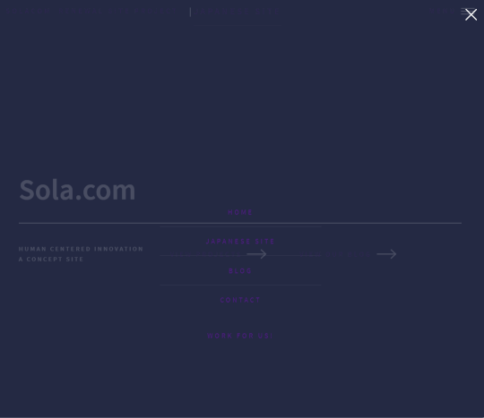
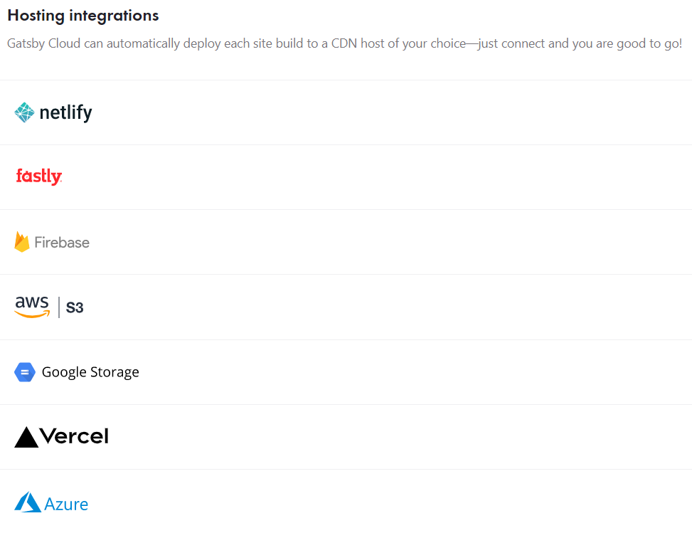

# Solacom Intern Report 

## 制作者

Daven Lu

## プロジェクト URL

https://solacom.gatsbyjs.io/

## プレビュー



## 概念

このプロジェクトはインターンのLu Davenが作った英語版コンセプトサイト。


| 詳細      |                                                           |
| ----------------------- | --------------------------------------------------------- |
| 名前                     | Daven Lu                                                  |
| ギットハブ               | https://github.com/msoup                                  |
| 会社名                   | Sola.com                                                  |
| 期間                     | 令和３年３月ー＞令和３年８月（半年）　                       |
| チームサイズ             | 1 (ソロプロジェクト)                                          |
| 目的                     | 外国の方にSolacomのことを知ってほしいので、サイトを制作した |
| プロジェクト URL      　 | https://solacom.gatsbyjs.io/                              |

## 目的

目的は３つあります：

1. Sola.comは積極的にインタナショナル学生やインターンを雇う
2. 日本語に弱いIT知識のある外国人が多い
3. スキルアップのために現代のフレームワークを使用したかった


## サイトの使い方

1. コードベースの変更

   1. Fork the repository via `git@github.com:MSoup/solacom.git`
   2. Navigate to the main directory `~solacom/`
   3. Type the following into the command line: `gatsby develop`

2. 新しいページの制作

   `src/pages`　でReactコンポーネントを作る. 

   1. Copy a random page, for example `src/meetTeam.js`

   2. Paste and rename it, for example to `src/test-page.js`

   3. Rename the helmet section as needed, for example:

      ```jsx
          <Helmet>
            <title>Solacom -  Test Page</title>
            <meta name="Test Page" content="Solacom Adding Extra Pages" />
          </Helmet>
      ```

   4. フォーマてィングに関しては

      `src/elements.js`を参考にしてください 

      情報が足りない場合は[gatsby documentation](https://www.gatsbyjs.com/docs/)を参考にしてください

   5. Link to this new page. An example of a gatsbyJS link route might be

      ``` <Link to="/test-page" className="link primary"></Link>```

3. Adding buttons

   1. There are two types of buttons, regular and special. Here is an example of both of them in use:

      ```jsx
                    <ul className="actions">
                      <li>
                        <a href="#/" className="button special">
                          Default
                        </a>
                      </li>
                      <li>
                        <a href="#/" className="button">
                          Default
                        </a>
                      </li>
                    </ul>
                    <ul className="actions small">
                      <li>
                        <a href="#/" className="button special small">
                          Small
                        </a>
                      </li>
                      <li>
                        <a href="#/" className="button small">
                          Small
                        </a>
                      </li>
                    </ul>
      ```

   2. Consult elements.js or the gatsbyJS documentation for more information on how to change the styling of buttons.

4. Making blog posts

   1. To make blog posts, you simply go to (2) to make a new page, and link to it from `src/landing.js`. 
   2. Remember to edit landing.js to change the preview text/formatting.

## Navigation

Below is a list of all the pages I published:

```
404.js  
contact.js  
cybersecurity.js  
elements.js  
farmAutomation.js  
generic.js  
index.js  
jointeam.js  
landing.js  
meetTeam.js  
omnioculus.js  
systemengineering.js  
test.js

Total: 13 pages
```

Below is a list of all of the components I published:

```
Banner.js  BannerLanding.js  Contact.js  Footer.js  Header.js  layout.js  Menu.js

Total: 7 pages
```


## 


## Hosting

GatsbyCloud: Gatsby Cloud is a unified cloud platform specifically built for the Gatsby framework that combines a modern developer toolset and workflow with an optimized, global edge network for an unbeatable Gatsby experience.

Benefits: 

1. Dramatically reduces build & deploy times
2. Simplifies content collaboration. Gatsby Preview lets you see changes instantly and holistically.
3. Removes the hassle of maintaining separate infrastructure to add dynamic functionality to a Gatsby site

If you wish to deploy the site build to a different CDN host, Gatsby Cloud can automatically integrate with most of them. See the picture below:



### Theme
HTML5 UP allows people to use their website templates to create seamless websites that are:

- fully responsive
- built on HTML5 and CSS3
- super customizable
- **FREE** under the Creative Commons


## What I learned
1. Bootstrap and React:

   Bootstrap and React play nicely together. React allows one to create reusable modules and Bootstrap lets me decorate them very quickly. Using the above boilerplate, I was able to make adjustments and change the site's flavor to suit what I wanted. It also meant that I could spend less time making things from scratch and more time organizing an existing template. 

2. Hosting

   I learned about the advantages and disadvantages of various hosts. It made sense to use Gatsby Cloud for a GatsbyJS site, as Gatsby Cloud was designed for sites built with GatsbyJS. 

3. Edge Networks

   Choosing a host based on where edge networks are located are important. Gatsby Cloud uses the fastly infastructure, which is why even an image-heavy site can load very fast with free hosting.

4. Form building

   I used the API endpoint from [getform.io](getform.io) in order to have a seamless contact form. This is because HTML inherently is prone to attack vectors, so using an established backend has three benefits:

   1. No backend required. This is nice because it keeps our application light and portable.
   2. Move security handling to third party. This can be a con, but for the purposes of a static website, it is nice to keep components modular.
   3. Contact form requests are sent to a centralized server and are separate from the company email. This allows for better separation between direct inquiries and form contact inquiries. Alert E-mails can be set up to be sent to the email service that is used most often. For example, [info@solanets.com](mailto: info@solanets.com). 


## Challenges
I had to learn how **routing** worked using GatsbyJS. The following were my observations:

Traditionally, routing works like this:

#### Traditional Routing

```
my-sample-project/
├── README.md
├── index.html
├── html
│   ├── contact.html
│   └── about.html
├── css
│   ├── contact.css
│   ├── about.css
│   └── styles.css
└── js
    ├── jquery-1.11.2.js
    └── scripts.js
```

With traditional routing, web pages are tucked away in nested folders, with an index.html in the top level folder so that the browser knows to go to index.html first. When linking between pages, you simply need an <a> tag, such as the following:

```html
  <body>
    ...
    <a href="html/contact.html">Contact Information</a>
    ...
  </body>
```


#### Routing with GatsbyJS

With GatsbyJS, you are working with a single page application, which means that there is only one html file, usually with some sort of entryway to serve your entire web application.

I positioned my file structure as follows:

```
// reduced for simplicity

solacom/
├── README.md
├── public  <- index located here 
│   ├── index.html
│   └── icons
└── src     <- all code located here
    ├── assets <- CSS here
    ├── components <- reusable components (banner.js, footer.js, header.js)
    ├── pages <- all pages (contact.js, elements.js, 404.js, generic.js, etc)
    └── styles.css
```

Routes can be created in three ways:

- By creating React components in `src/pages`
- By using the [File System Route API](https://www.gatsbyjs.com/docs/reference/routing/file-system-route-api/) to programmatically create pages from GraphQL and to create client-only routes.
- By implementing the API [`createPages`](https://www.gatsbyjs.com/docs/reference/config-files/gatsby-node/#createPages) in your site’s `gatsby-node.js`. ([Plugins](https://www.gatsbyjs.com/docs/plugins/) can also implement `createPages` and create pages for you.)

Source: https://www.gatsbyjs.com/docs/reference/routing/creating-routes/

I simply created pages in `src/pages`.

## Other Contributions to Sola.com

**Mentor for new intern**

I assisted a fellow intern with learning python and its associated libraries. (Pandas, numpy, opencv).

## CSS Grid

The grid on this site was replaced with a custom version, built using CSS Grid. It's a very simple 12 column grid that is disabled on mobile. To start using the grid, wrap the desired items with `grid-wrapper`. Items inside the `grid-wrapper` use the class `col-` followed by a number, which should add up to 12.

Here is an example of using the grid, for a 3 column layout:

```
<div className="grid-wrapper">
    <div className="col-4">
        <p>Content Here</p>
    </div>
    <div className="col-4">
        <p>Content Here</p>
    </div>
    <div className="col-4">
        <p>Content Here</p>
    </div>
</div>
```

## Credits

This website would not be possible without the boilerplate and theme created by HTML5 UP. 

The boilerplate can be found [here](https://github.com/codebushi/gatsby-starter-forty).
