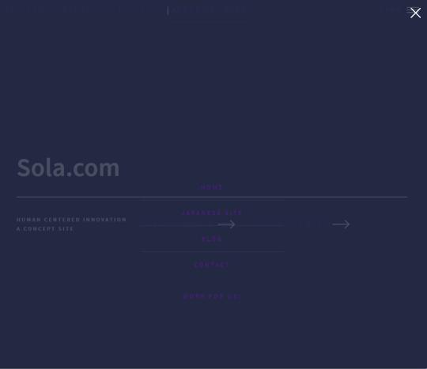
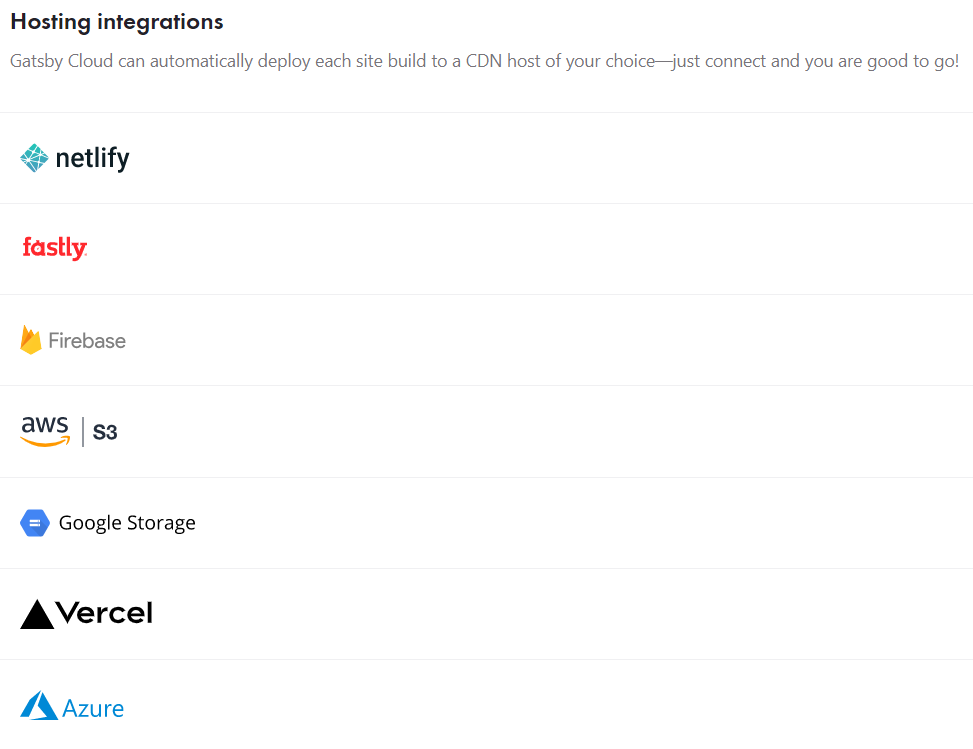

# Solacom Intern Report 

## Author

Daven Lu

## Project URL

https://solacom.gatsbyjs.io/

## Preview



## Abstract

The *Sola.com English Concept Site* is a project I created as an intern at Sola.com. The below is the conditions of the internship:

| Internship Details      |                                                           |
| ----------------------- | --------------------------------------------------------- |
| Intern Name             | Daven Lu                                                  |
| Github                  | https://github.com/msoup                                  |
| Internship Company Name | Sola.com                                                  |
| Internship Duration     | March 2021 - August 2021 (6 months)                       |
| Team Size               | 1 (Solo Project)                                          |
| Purpose                 | Skills Development, Making Site for Non-Japanese Audience |
| Tasks                   | Scripting, web development, python, openCV, reactJS       |
| Final Project           | Remake Sola.com website using web frameworks              |
| Final Project URL       | https://solacom.gatsbyjs.io/                              |

## Purpose

My motives for creating this website are three-fold:

1. Sola.com has many international students and interns
2. Many people viewing the Sola.com website are not native level Japanese speakers
3. I wanted to give back to Sola.com for the opportunity to intern with the company

## Hosting

GatsbyCloud: Gatsby Cloud is a unified cloud platform specifically built for the Gatsby framework that combines a modern developer toolset and workflow with an optimized, global edge network for an unbeatable Gatsby experience.

Benefits: 

1. Dramatically reduces build & deploy times
2. Simplifies content collaboration. Gatsby Preview lets you see changes instantly and holistically.
3. Removes the hassle of maintaining separate infrastructure to add dynamic functionality to a Gatsby site

If you wish to deploy the site build to a different CDN host, Gatsby Cloud can automatically integrate with most of them. See the picture below:



### Theme
HTML5 UP allows people to use their website templates to create seamless websites that are:

- fully responsive
- built on HTML5 and CSS3
- super customizable
- **FREE** under the Creative Commons


## What I learned
1. Bootstrap and React:

   Bootstrap and React play nicely together. React allows one to create reusable modules and Bootstrap lets me decorate them very quickly. Using the above boilerplate, I was able to make adjustments and change the site's flavor to suit what I wanted. It also meant that I could spend less time making things from scratch and more time organizing an existing template. 

2. Hosting

   I learned about the advantages and disadvantages of various hosts. It made sense to use Gatsby Cloud for a GatsbyJS site, as Gatsby Cloud was designed for sites built with GatsbyJS. 

3. Edge Networks

   Choosing a host based on where edge networks are located are important. Gatsby Cloud uses the fastly infastructure, which is why even an image-heavy site can load very fast with free hosting.

4. Form building

   I used the API endpoint from [getform.io](getform.io) in order to have a seamless contact form. This is because HTML inherently is prone to attack vectors, so using an established backend has three benefits:

   1. No backend required. This is nice because it keeps our application light and portable.
   2. Move security handling to third party. This can be a con, but for the purposes of a static website, it is nice to keep components modular.
   3. Contact form requests are sent to a centralized server and are separate from the company email. This allows for better separation between direct inquiries and form contact inquiries. Alert E-mails can be set up to be sent to the email service that is used most often. For example, [info@solanets.com](mailto: info@solanets.com). 


## Challenges
I had to learn how **routing** worked using GatsbyJS. The following were my observations:

Traditionally, routing works like this:

#### Traditional Routing

```
my-sample-project/
├── README.md
├── index.html
├── html
│   ├── contact.html
│   └── about.html
├── css
│   ├── contact.css
│   ├── about.css
│   └── styles.css
└── js
    ├── jquery-1.11.2.js
    └── scripts.js
```

With traditional routing, web pages are tucked away in nested folders, with an index.html in the top level folder so that the browser knows to go to index.html first. When linking between pages, you simply need an <a> tag, such as the following:

```html
  <body>
    ...
    <a href="html/contact.html">Contact Information</a>
    ...
  </body>
```


#### Routing with GatsbyJS

With GatsbyJS, you are working with a single page application, which means that there is only one html file, usually with some sort of entryway to serve your entire web application.

I positioned my file structure as follows:

```
// reduced for simplicity

solacom/
├── README.md
├── public  <- index located here 
│   ├── index.html
│   └── icons
└── src     <- all code located here
    ├── assets <- CSS here
    ├── components <- reusable components (banner.js, footer.js, header.js)
    ├── pages <- all pages (contact.js, elements.js, 404.js, generic.js, etc)
    └── styles.css
```

Routes can be created in three ways:

- By creating React components in `src/pages`
- By using the [File System Route API](https://www.gatsbyjs.com/docs/reference/routing/file-system-route-api/) to programmatically create pages from GraphQL and to create client-only routes.
- By implementing the API [`createPages`](https://www.gatsbyjs.com/docs/reference/config-files/gatsby-node/#createPages) in your site’s `gatsby-node.js`. ([Plugins](https://www.gatsbyjs.com/docs/plugins/) can also implement `createPages` and create pages for you.)

Source: https://www.gatsbyjs.com/docs/reference/routing/creating-routes/

I simply created pages in `src/pages`.

## Other Contributions to Sola.com

**Mentor for new intern**

I assisted a fellow intern with learning python and its associated libraries. (Pandas, numpy, opencv).


## CSS Grid

The grid on this site was replaced with a custom version, built using CSS Grid. It's a very simple 12 column grid that is disabled on mobile. To start using the grid, wrap the desired items with `grid-wrapper`. Items inside the `grid-wrapper` use the class `col-` followed by a number, which should add up to 12.

Here is an example of using the grid, for a 3 column layout:

```
<div className="grid-wrapper">
    <div className="col-4">
        <p>Content Here</p>
    </div>
    <div className="col-4">
        <p>Content Here</p>
    </div>
    <div className="col-4">
        <p>Content Here</p>
    </div>
</div>
```

## Credits

This website would not be possible without the boilerplate and theme created by HTML5 UP. 

The boilerplate can be found [here](https://github.com/codebushi/gatsby-starter-forty).
